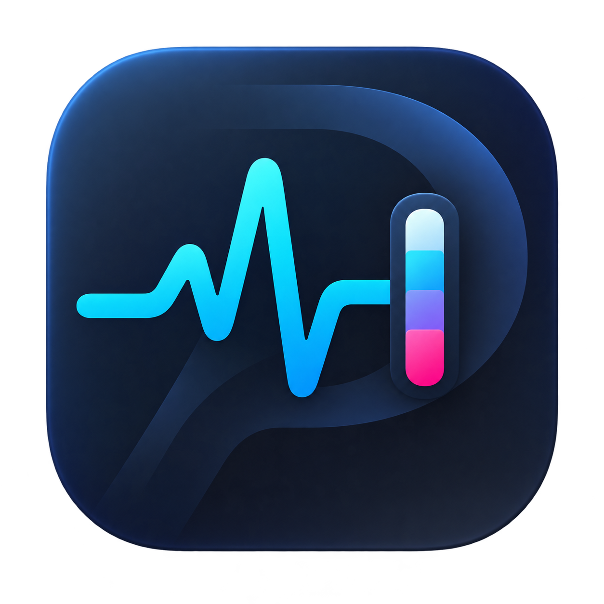
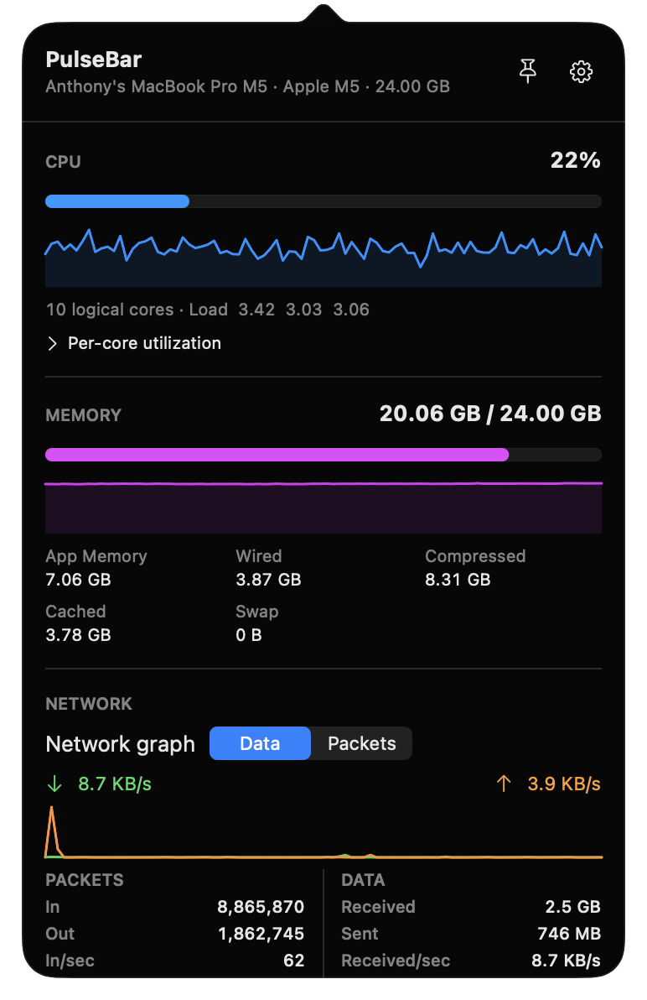
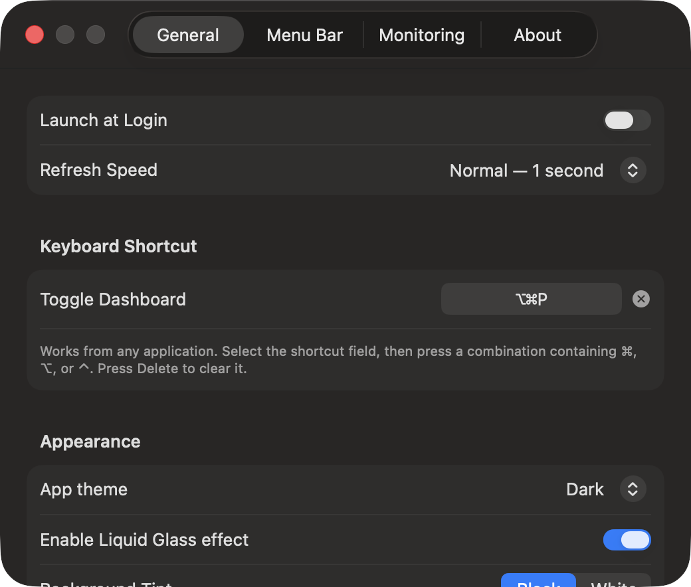

<div align="center">
  
  <h1>PulseBar</h1>
  <p>A small, native macOS system monitor that keeps the numbers I care about in the menu bar.</p>

  
  
  
  [](LICENSE)
</div>

<br>

<p align="center">
  
</p>

<p align="center">
  
</p>

## Why PulseBar?

I wanted a system monitor that stays out of the way but still gives me useful information at a glance. PulseBar lives entirely in the menu bar, opens quickly, and uses native macOS APIs—no Dock icon, analytics, or background database.

PulseBar was inspired by [Vitals](https://extensions.gnome.org/extension/1460/vitals/), the excellent system-monitoring extension for GNOME Shell.

## What it shows

- Live CPU usage, load averages, and per-core utilization
- Activity Monitor-style memory accounting
- Network speed, packet rates, and session totals
- Disk read/write activity and storage usage
- Battery level and macOS thermal state
- Smooth menu-bar values with fixed or dynamic width
- Up to five menu-bar statistics, freely reordered in Settings
- A pin option to keep the dashboard visible
- System, light, and dark appearances with Liquid Glass controls

The menu-bar labels can be compact or descriptive. Changes are saved automatically.

## Make it yours

<p align="center">
  
</p>

Open **Settings** to reorder statistics, choose which monitors run, change the refresh speed, keep values at fixed positions, or customize the global dashboard shortcut.

The default shortcut is <kbd>⌥</kbd> <kbd>⌘</kbd> <kbd>P</kbd>. Press it once to open PulseBar and again to close it—even when another app is active.

## Install

Install the latest release with one command:

```sh
curl -fsSL https://raw.githubusercontent.com/markylaredo/pulsebar/master/install.sh | bash
```

The installer verifies the release checksum and code signature, copies PulseBar to `/Applications`, and opens it. macOS may ask for your administrator password when installing into `/Applications`.

See the [installation guide](docs/INSTALLATION.md) for updates, custom install locations, uninstalling, and troubleshooting.

### Uninstall

```sh
curl -fsSL https://raw.githubusercontent.com/markylaredo/pulsebar/master/uninstall.sh | bash
```

The uninstaller disables Launch at Login and moves PulseBar to the Trash. Your preferences are kept if you decide to reinstall later.

### Build from source

PulseBar currently requires macOS 14 or later and Xcode 16 or later.

```sh
git clone https://github.com/markylaredo/pulsebar.git
cd pulsebar
open PulseBar.xcodeproj
```

In Xcode, select the **PulseBar** scheme, choose your Mac, and press **Run**. PulseBar will appear in the menu bar.

> **Launch at Login:** macOS expects a normally signed copy in `/Applications`. Xcode debug builds may be rejected by login-item registration.

Release maintainers can find the required archive and checksum steps in [the release guide](docs/RELEASING.md).

## Verify the project

```sh
xcodebuild -project PulseBar.xcodeproj \
  -scheme PulseBar \
  -configuration Debug \
  -derivedDataPath .build \
  CODE_SIGNING_ALLOWED=NO test
```

## A note about accuracy

PulseBar reads macOS system counters through Mach APIs, IOKit, and other public system interfaces. Its accounting follows Activity Monitor where practical, although live values can differ slightly when the two apps sample at different moments.

Temperature and fan RPM are not available in V1. Apple does not provide a stable public API for those sensors, and PulseBar intentionally avoids private SMC APIs.

## Support the project

If PulseBar is useful to you, a ⭐ helps other Mac users find it. Bug reports and focused improvements are welcome through [GitHub Issues](https://github.com/markylaredo/pulsebar/issues).

If you would like to support continued development, you can [send a tip through PayPal](https://paypal.me/markanthony495).

[](https://paypal.me/markanthony495)

**Topics:** `macos` · `swift` · `swiftui` · `menu-bar-app` · `system-monitor` · `apple-silicon` · `performance-monitoring`

## License

PulseBar is source-available under the [PolyForm Noncommercial License 1.0.0](LICENSE). Personal and other non-commercial use is welcome. Selling PulseBar, including modified copies, requires a separate written commercial license from the copyright holder.

Created by **Mark Anthony**.
